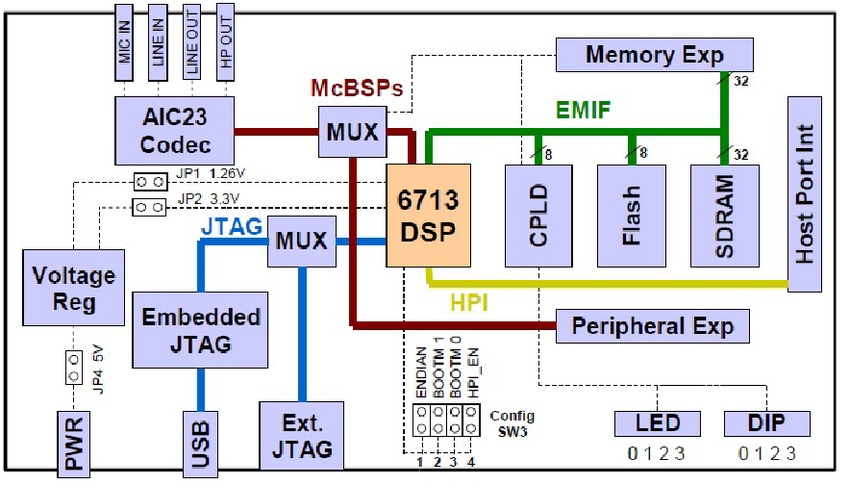

# DSP Audio Encryption on TMS320C6713

  

<h2>📄 Project Overview</h2>

  This project presents the design and implementation of a basic audio encryption and decryption system using a Digital Signal Processor (DSP), specifically the Texas Instruments (TI) TMS320C6713. The system demonstrates simple, real-time encryption techniques suitable for the capabilities of this DSP platform. Instead of relying on complex cryptographic standards like AES or RSA, it employs lightweight methods such as:

<ul>
  <li>Pseudo-random key-stream generation with XOR operations</li>
  <li>Data permutation techniques</li>
</ul>

The report covers:

<ul>
  <li>An analysis of the TMS320C6713 architecture</li>
  <li>The associated Development Starter Kit (DSK)</li>
  <li>Development using Code Composer Studio</li>
  <li>Implementation of custom encryption methods</li>
  <li>Integration within a real-time audio processing pipeline</li>
  <li>Testing and verification approaches</li>
</ul>

<blockquote>
  <strong>⚠️ Note:</strong> The techniques used are not intended for high-security applications, but rather to demonstrate basic confidentiality and deter casual eavesdropping. The emphasis is on implementing low-overhead, real-time algorithms on embedded hardware.
</blockquote>

